# Do It, Pass It micro:bit game
 
# Leader notes

## Overview

This activity fulfills Stage 2, Requirement 3 of the Digital Maker Staged Activity Badge (Make a simple digital creation that uses code to interact with the wider world through inputs (such as buttons or typing on a keyboard) and outputs (such as a computer screen, sound, or lights).

Young people will make a 'Do it; pass it' game using the BBC micro:bit. Players will need to perform an action shown on the micro:bit and then pass the micro:bit on to the next person. When the timer runs out the group will see their score and can keep playing to try and beat it. 

## Information 

+ Time - 30-60 minutes (plus time to play the game) 
+ Group size -  Flexible (ideally two young people per computer); Larger groups can play the game
+ Preparation needed - If you’re running this activity without access to WiFi, you will need to download the software
ahead of time. You may also wish to print handouts 
+ Location - Wherever you have access to computers. The game can be played indoors or outdoors.

## You will need

Per pair
+ Computers or mobile devices
+ BBC micro:bit
+ One USB A to micro USB B cable for programming (not needed for mobile devices)
+ Battery pack and batteries
+ One crocodile clip lead (not essential)
+ A torch
+ Optionally, additional input and output components such as buttons and buzzers.
+ Optionally, craft materials such as elastic bands, card board, sticky tape and scissors.
+ Activity handouts

### If your meeting place has WiFi

Run the micro:bit MakeCode editor in a web browser using this link: rpf.io/makecode.

### If your meeting place doesn’t have WiFi

Download the micro:bit MakeCode app beforehand (Windows only); refer to the micro:bit guide rpf.io/scouts-microbit for instructions.

## Key messages

+ Computers interact with the world through inputs and outputs
+ The BBC micro:bit is a small computer with built-in inputs and a display of 25 LED lights. You can also connect additional inputs and outputs to the micro:bit using its pins (labelled 0, 1 and 2).
+ You can make your own electronic gadgets with a programmable device, code, electronic components and other materials. 

## Alternatives

+ You can use the MakeCode simulator to create the project if you don't have access to micro:bit devices. 

## Safety

If the young people are working online, tell them to ask for permission before viewing any other websites. It’s a good idea to set up parental controls — you can find instructions for this on the NSPCC website (rpf.io/scouts-nspcc-online).

You should also give each young person a Stay Safe leaflet (rpf.io/scouts-staysafe).

## Adaptability

+ The project is staged so young people do not have to complete later steps to have a complete game. 
+ Depending on how much time you have a available, you can make a simple version of the project or you can add additional components and craft materials to extend the project.
+ Young people with more advanced coding skills could create the same project using JavaScript in the MakeCode editor or Python with the Mu editor.

## Community and sharing

+ Why not take your finished games to a district Scout camp and encourage other sections to earn their Digital Making badge.

## Leader Instructions

+ If they have not used them before, introduce the young people to the micro:bit. Explain that micro:bits not only have two buttons
(for input) and a small LED display (for output), they also have sensors such as a light sensor and an accelerometer that can detect movement. Also point out the pins (labelled 0, 1, 2) that can be used to connect additional inputs and outputs.

+ Explain that young people will be creating a game that can be played in a circle at camp or just for fun. They will program the micro:bit to display images that correspond to actions they must perform such as pressing a button or shining a light. Each player must perform an action and then pass the micro:bit to the next player. The goal is to score as many points as possible before the timer runs out. 

+ If the young people have not used the micro:bit with MakeCode before, demonstrate the editor and show them how to connect the micro:bit with a USB cable and download a program. Explain that blocks are colour-coded to make them easy to find.

+ Get the young people to open the MakeCode editor on their own computers and connect their micro:bits. 

+ Let them work through the rest of the instructions. Things to look out for:
  + Check that the maximum in `pick random` matches the number of actions otherwise some actions won't get chosen.
  + Make sure that the metal part of the crocodile clip touches the pin, the sleeve is not conductive.

+ As pairs finish they can try out their game and join others to make larger groups. 

+ If you have time, you can provide additional electronic components and craft materials so they can extend the game. 

+ Close with a discussion about how it felt to make their own electronic game rather than just buying one. Can they think of other games that they could make that would fit in with Scouting activities?

## Did you know?
The Simon electronic memory game was first made in 1978. It has a microcontroller (mini computer like the micro:bit), electronics components code and a plastic case. The Bop it! game introduced in 1996 uses similar technology to create a game with voice commands and a variety of inputs. Now technology has reached the point where young people can make their own electronic games using programmable devices such as the BBC micro:bit, Arduino and Raspberry Pi.

## Discuss
What electronic toys and games have you played with? 

# Do It, Pass It micro:bit game

# Handout

## Display an action

The micro:bit has a display of 25 red LED lights that provide an **output**. You will program the display to show an action for the player to perform. 

You'll start with showing a letter 'A' to tell the player to press the 'A' button on the micro:bit or a maraca (shaker) to show that they need to shake the micro:bit.

1. Open the MakeCode editor using this link: rpf.io/makecode. 

2. Add a new variable to store the action that the player needs to take:

  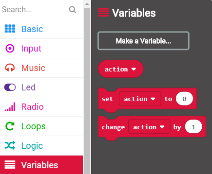

  New blocks will be added to the `Variables`{:class="microbitvariables"} section to set and change the `action`{:class="microbitvariables"} variable.

3. Add code to your `forever`{:class="microbitbasic"} loop to randomly choose an action: 1 for the A button and 2 for a shake. 

  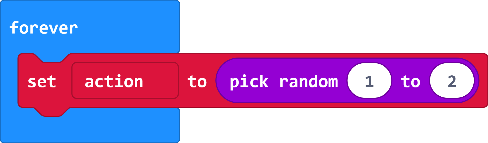

4. Add code to the bottom of your `forever`{:class="microbitbasic"} loop to display an image corresponding to the chosen action: 

  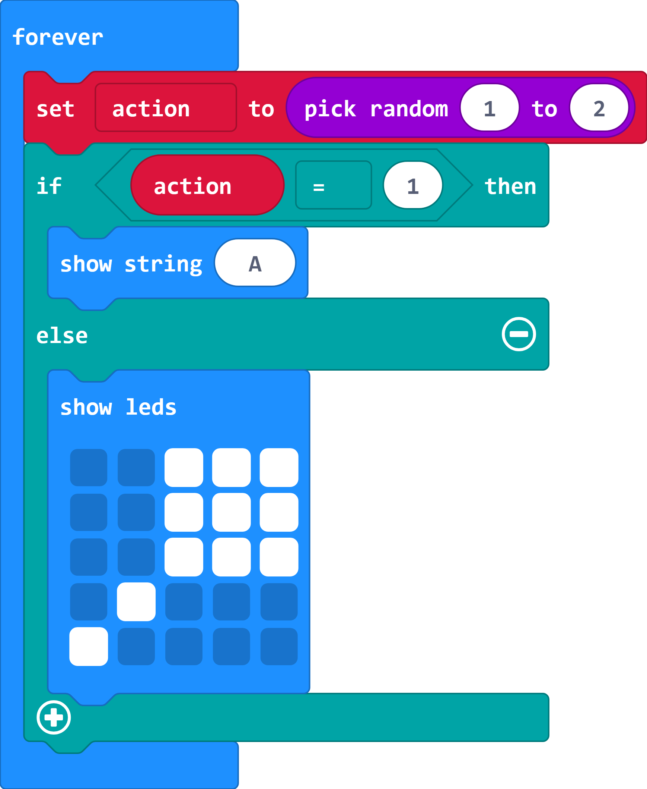

  Click on the squares in the `show leds`{:class="microbitbasic"} block to make the maraca image.

5. Your code will automatically run in the simulator. You should randomly see either the letter 'A' or a maraca (shaker) image. 

## Get Input

Next you will add code to detect when the player provides **input** by pressing the A button or shaking the micro:bit. 

1. Add code to detect when the 'A' button is pressed and set the `action`{:class="microbitvariables"} variable to 0 to show that the action has been completed. This should only be done if the current action is 1 (A button).

  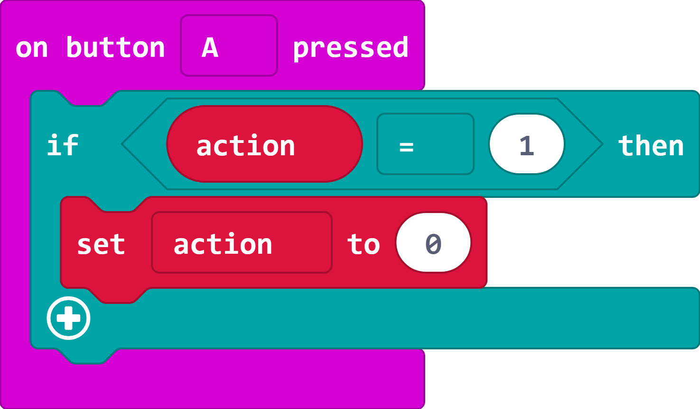

2. Now add code to the bottom of your `forever` loop to wait until the `action`{:class="microbitvariables"} variable gets set to 0 so that the player needs to complete the action before seeing another action. 

  

3. You'll also need to detect the shake action. Note that this time you need to check that the current action is 2 (shake).

  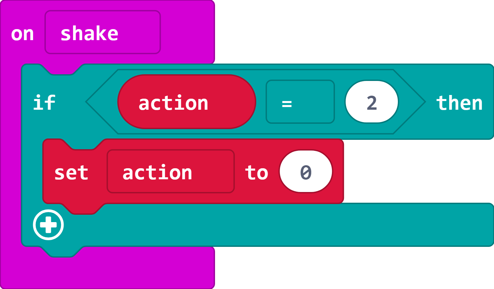

4. Now you can test your game in the simulator. If you see an A then press the A button, if you see a maraca then click Shake. 

  Note that you can get the same action twice so if you see the same action again then you need to repeat it. 

5. You can also try your game on your micro:bit. Connect it to your computer with a USB cable. 

6. Click settings and then 'Pair device'.

7. Click Download to transfer your code to the micro:bit. From now on you can just click Download to transfer your code. 

8. Test your code on the micro:bit.

## Keep score

Next you will turn your project into a game with a timer and a score. The MakeCode editor includes `Game` blocks to help you do this.

1. The `Game` section includes a `countdown`{:class="microbitgame"} blocks which starts a timer. The default amount of time is 10000 milliseconds, or 10 seconds. This is fine for testing your game, you can increase it later. There's also a `score`{:class="microbitgame"} variable which you should set to 0 at the beginning of a game.

  Add code to set up the game to the `start`{:class="microbitbasic"} block.

  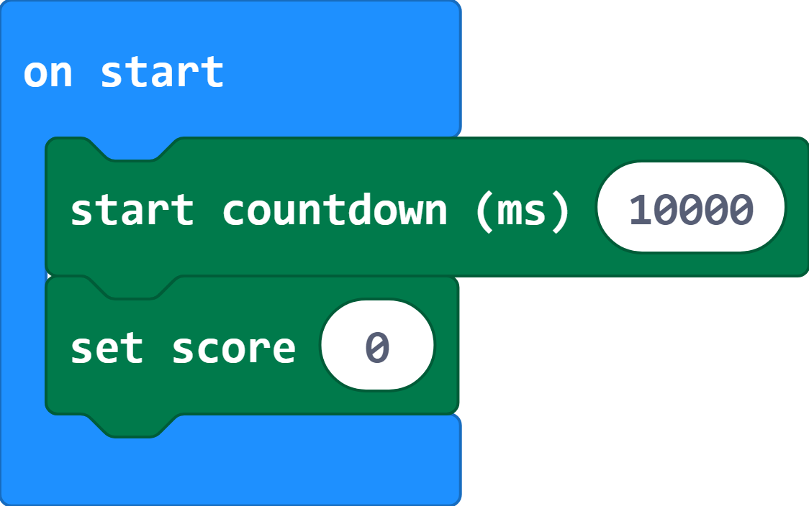

2. Your code will automatically run in the simulator. Notice that there's an animation at the beginning of the game, and after 10 seconds then game will finish and show 'GAME OVER' and your score. 

3. At the moment, the score will always be 0. You can fix that by adding a `change score`{:class="microbitgame"} block when you detect a correct input. You'll need to do this for the A button and shake actions.

  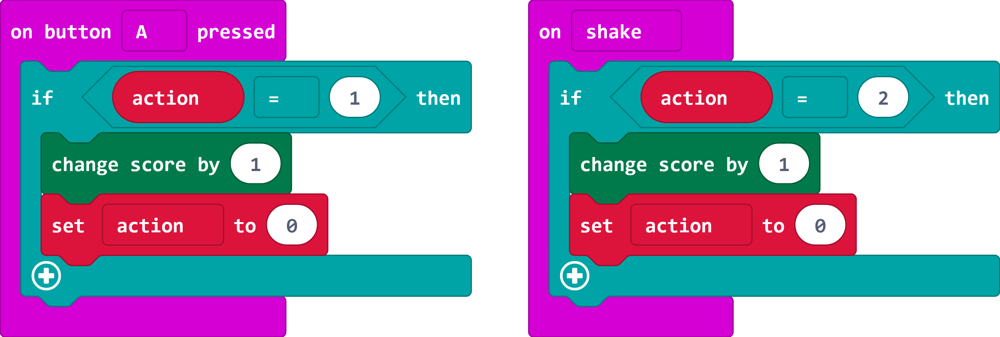

4. Now test your game and you will see a score at the end. You will also see a short animation when the score increases.

5. To play the game again, press the reset button on the back of the micro:bit. 

6. You can change the timer to give yourself more time. 60000 milliseconds is one minute. 

7. Now play the game with two people. Pass the micro:bit to the other player each time you complete an action. You can play in larger groups too. 

## More input actions!

At this point you have a complete game, but it only has two different actions. Next you'll add another action, connecting and then releasing or 'pressing' pin 0. The player will provide this input by connecting a crocodile clip lead from GND to pin 0. 

Once you've done that you can have a go at adding your own actions.

1. Change your `pickrandom`{:class="microbitmath"} block so that it chooses a number between 1 and 3. 

  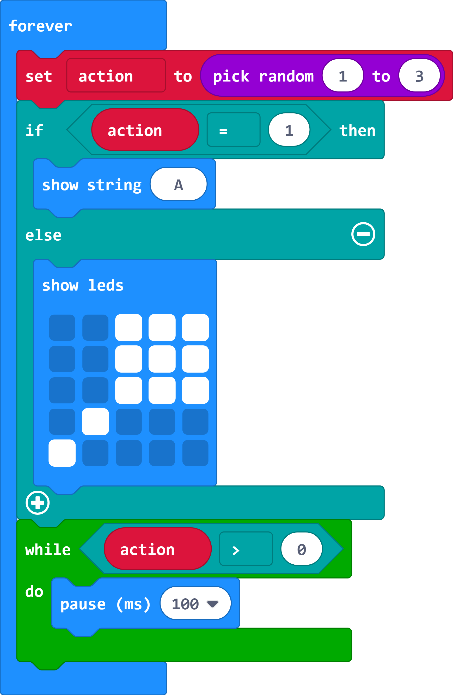

2. Add an `else if`{:class="microbitlogic"} section to your action output code by clicking on the plus button. 

  Change your code so that it displays the maraca if the action is 2 and add a `show number`{:class="microbitbasic"} block to the else section to display a 0. 

   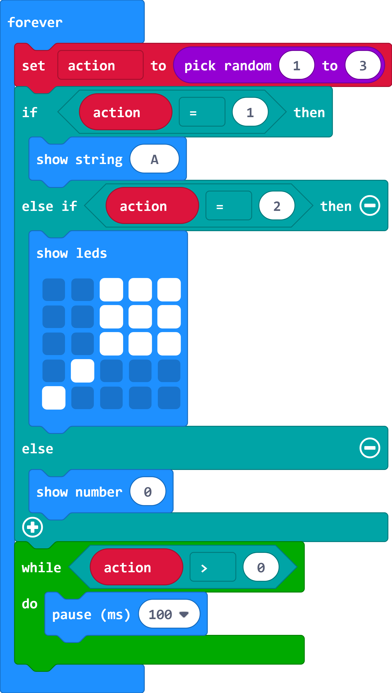

3. Now add code to detect that Pin 0 has been connected and then released (pressed).

  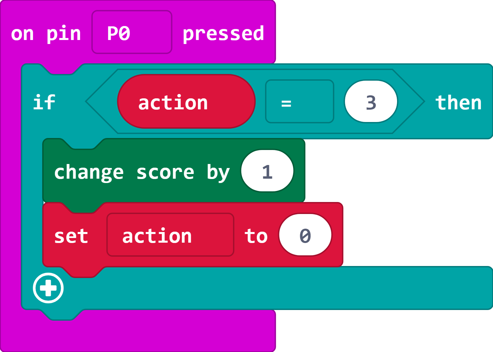

4. You can test your code in the simulator by clicking on Pin 0 when a '0' is shown on the display. 

5. Download your code to your micro:bit. 

6. Connect one end of a crocodile clip lead to GND. 

  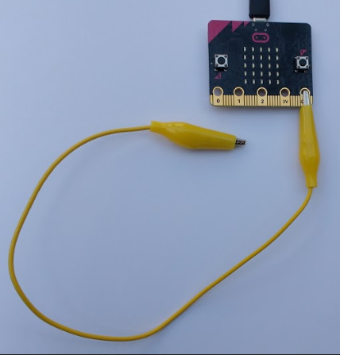

7. Test your game. When a '0' appears on the display, tap the other end of the crocodile clip lead on the 0 pin. 

  If you don't have a crocodile clip lead then you can hold the GND pin with one hand and then touch and release pin 0 with the other hand. This works because you skin is conductive (if it doesn't work then you might need to drink more!)
  
8. Now try and add an action of your own. Each of the `input`{:class="microbitinput"} blocks you have used has a drop-down with other options. For each action you'll need to:

  + Increase the maximum in the `pick random`{:class="microbitmath"} block by one.
  + Add another `else if`{:class="microbitlogic"} section to display an image for your action
  + Add an `input`{:class="microbitinput"} block and code to detect when the action is correctly performed. 

## Light!

You can also use readings from micro:bit sensors as inputs. You're going to add another action to detect when a bright light is shone on the micro:bit. You'll need a torch (or a mobile phone with a torch option).

1. Increase the maximum in your `pick random`{:class="microbitmath"} by one to increase the number of possible actions. This number will depend on how many actions you have added. 

2. Add an `else if`{:class="microbitlogic"} section to your action output code by clicking on the plus button. 

  Change your code so that you have an extra action for shining a torch on the micro:bit.  

   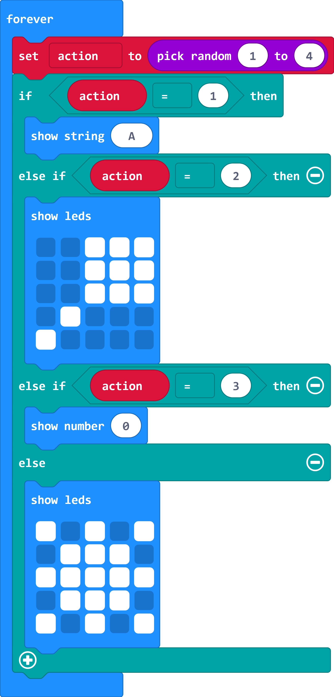

   You can design a different image if you like. 

3. The `light level` variable returns a number from 0 (dark) to 255 (bright). When you first use the light sensor on the micro:bit it returns 255 initially so we need to wait until the number drops. (This also means that you can't just shine a light on the micro:bit all of the time and cheat!)

  

4. Now add code to check for the light level being high when the corresponding action is selected:

  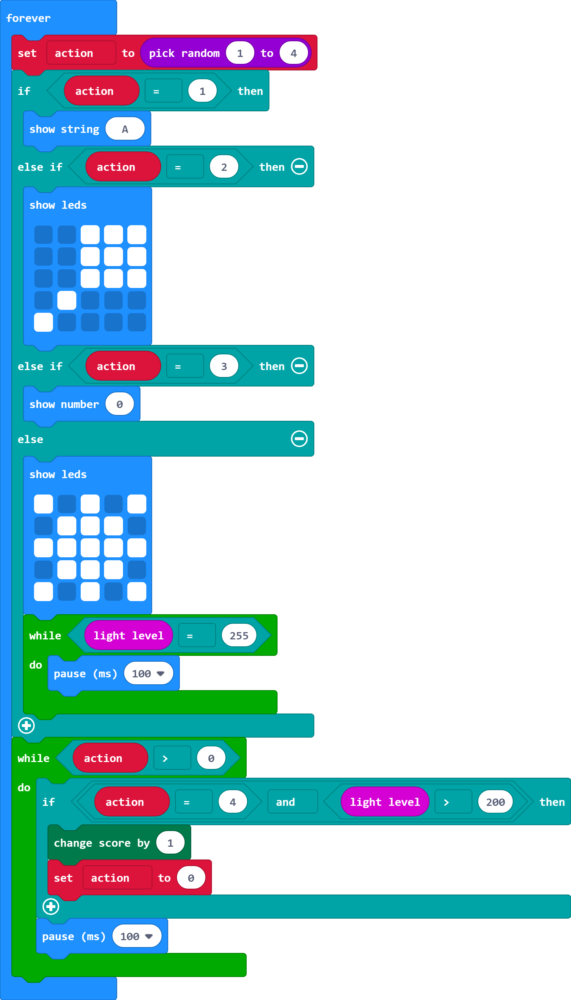

5. Download your code and test your game. When the light symbol appears, shine a torch on the micro:bit. 

  If you are playing in bright sunlight then you might want to adapt the game so that the action is making it dark by covering the micro:bit display. 

6. Adjust the amount of time if you need longer to play. 

## What next?

You can add more input actions and more outputs to the game if you like. 

Ideas to try:

+ Experiment with different gestures such as tilt and logo up. You'll need to come up with your own images and remember what they mean.

+ Add actions for tapping on different pins with the crocodile clip lead (you can leave the other end connected to GND).

+ Can you use the magnetometer sensor to detect when a magnet or magnetic object comes near the micro:bit.

+ What about using the compass reading? 

+ Or the temperature sensor - could you move the micro:bit closer to the camp fire? Be careful!

+ How about adding different outputs. You could light up a green LED when you complete an action, or add a buzzer for sound effects. 

